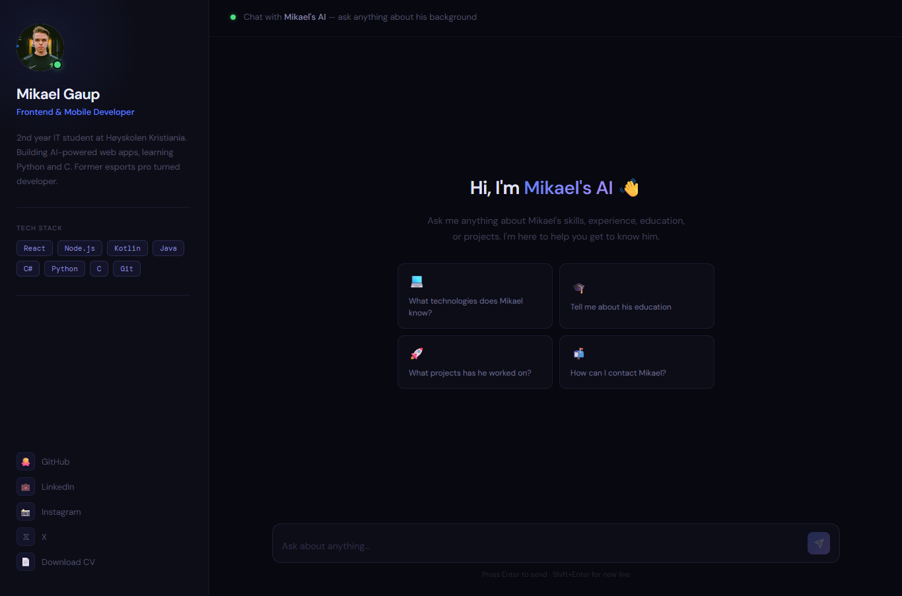

# 🤖 AI Portfolio — mikaelgaup.com

A personal portfolio website powered by a locally running AI that knows everything about me. Built with React, Node.js and Ollama running on an RTX 5090 GPU.

**Live demo:** [mikaelgaup.com](https://mikaelgaup.com)



---

## What it does

Instead of a traditional portfolio, visitors can **chat with an AI** that answers questions about my skills, experience, education and projects — in both Norwegian and English.

- Ask it anything: *"What technologies does Mikael know?"*, *"Tell me about his experience"*, *"How can I contact him?"*
- Answers based on real documents (CV, project info) via RAG
- Remembers context within a conversation
- Runs entirely on local hardware — no OpenAI API, no cloud costs

---

## Tech Stack

**Frontend**
- React + Vite
- Custom CSS (no UI library)
- Deployed on Vercel

**Backend**
- Node.js + Express
- Ollama (llama3.1) running locally on RTX 5090
- RAG (Retrieval Augmented Generation) for document-based answers
- Deployed via Cloudflare Tunnel with permanent domain

**AI**
- Model: llama3.1 via Ollama
- RAG with keyword-based chunk retrieval
- Conversation history for multi-turn chat
- PDF and TXT document ingestion

---

## Architecture

```
User → Vercel (React frontend)
          ↓
     api.mikaelgaup.com (Cloudflare Tunnel)
          ↓
     Node.js + Express (local PC)
          ↓
     Ollama + llama3.1 (RTX 5090)
```

---

## Features

- 💬 Chat interface similar to ChatGPT
- 📄 RAG — AI reads uploaded documents to answer accurately
- 🧠 Conversation history — remembers earlier messages
- 🌍 Bilingual — responds in Norwegian or English based on input
- 🔒 Hidden admin panel for uploading documents
- 📱 Mobile responsive
- ⚡ Fast responses powered by RTX 5090

---

## Running locally

**Prerequisites:** Node.js, Ollama installed

```bash
# Pull the model
ollama pull llama3.1

# Clone the repo
git clone https://github.com/realmikki/ai-portfolio.git
cd ai-portfolio

# Start backend
cd server
npm install
node server.js

# Start frontend
cd ../client
npm install
npm run dev
```

Open [http://localhost:5173](http://localhost:5173)

---

## What I learned

- Building and deploying a full-stack AI application from scratch
- RAG (Retrieval Augmented Generation) for document-based Q&A
- Running LLMs locally with Ollama
- Cloudflare Tunnel for exposing local services
- React, Node.js, Express in a real project context

---

## About me

2nd year IT student at Høyskolen Kristiania, studying frontend and mobile development. Former professional esports athlete, currently working in IT support while building AI-powered applications.

[LinkedIn](https://www.linkedin.com/in/mikael-gaup-775699353/) · [mikaelgaup.com](https://mikaelgaup.com)